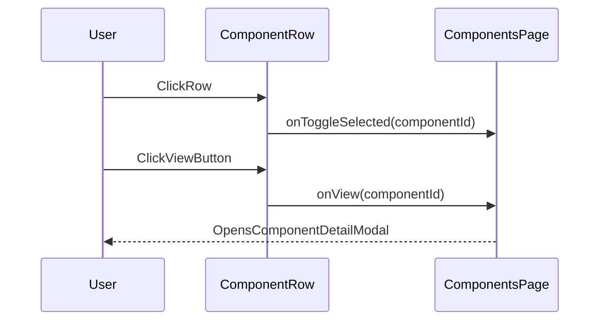

# Components list milestone-chip layout

## Goal

Make the **Components list/table** match the **Test Package component list** milestone layout (green/amber/gray milestone chips), while ensuring:

- **Rows are selectable** (for bulk assign)
- The **details modal still opens**, but via an explicit **View** action (not row click)
- Milestones render as a **single line** (no horizontal scrolling), matching the Test Package look

## What we’ll reuse

- The milestone chip rendering logic already in [`src/pages/PackageDetailPage.tsx`](src/pages/PackageDetailPage.tsx) (complete = green, partial = amber, otherwise gray).

## Data changes (required)

The main components query (`useComponents`) currently does **not** join milestone template config, so it can’t reliably render chips in template order.

- Update [`src/hooks/useComponents.ts`](src/hooks/useComponents.ts) to also select the component’s template milestone config via `progress_templates(milestones_config)` (same approach used by `usePackageComponents` in `usePackages.ts`).
  - Keep using `current_milestones` from the `components` row.
  - This enables: `milestones_config.map(m => current_milestones[m.name])`.

## UI/UX changes

### 1) Add selection + View action to the Components list

Modify the virtualized list rendering:

- [`src/components/ComponentList.tsx`](src/components/ComponentList.tsx)
  - Add a **checkbox column** in the header.
  - Add a new **Milestones** column.
  - Add a right-side **View** column/button.
  - Extend props:
    - `selectedComponentIds: string[]`
    - `onToggleSelected(componentId: string): void`
    - `onView(componentId: string): void`

- [`src/components/ComponentRow.tsx`](src/components/ComponentRow.tsx)
  - Change row click behavior: **row click toggles selection** (per your decision).
  - Add a **View** button/icon that calls `onView` and does *not* toggle selection.
  - Render milestone chips in a single line, using the same classes as the package view.

### 2) Wire selection state from ComponentsPage

- [`src/pages/ComponentsPage.tsx`](src/pages/ComponentsPage.tsx)
  - Pass `selectedComponentIds` and handlers into `ComponentList`.
  - Implement `onView` to set `selectedComponentId` (so the details modal opens).
  - Ensure the existing bulk Assign button (already keyed off `selectedComponentIds.length`) becomes functional.

### 3) Share milestone chip renderer (recommended)

To avoid duplicating chip logic:

- Extract the chip UI into a small shared component, e.g. `src/components/milestones/MilestoneChips.tsx`.
- Use it in both:
  - [`src/pages/PackageDetailPage.tsx`](src/pages/PackageDetailPage.tsx)
  - [`src/components/ComponentRow.tsx`](src/components/ComponentRow.tsx)

This makes it easy to keep the “green highlight” behavior identical everywhere.

## Interaction flow (new)

## Testing / acceptance criteria

- Components list shows a **Milestones** column with up to 6 chips per row.
- Chip colors match package view:
  - Complete: green
  - Partial milestone in-progress: amber
  - Not started: gray
- Clicking a row toggles selection and updates the bulk assign button count.
- Clicking **View** opens the details modal for that component.
- Performance remains acceptable (still virtualized; only visible rows render chips).

## Rollout notes

- If the added join increases payload noticeably, we can gate milestone config fetching behind a “show milestones” toggle later, but we’ll start simple since max 6 chips and virtualization is already in place.